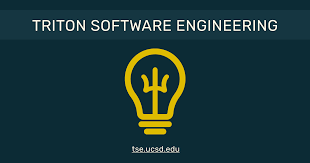

Attached are some images of my involvement in clubs and extracurriculars at UCSD.

**_I have secured a variety of leadership positions in these clubs_**

In CSES, I served as its President for the 2023-2024 Academic Year. In ACMAI, I served as an Event Lead that focused on Recommendation based Algorithms and NLP and also pioneered a new AI School for students. In TSE, I continue to hone my Full-Stack Development skills and have worked on two pro-bono projects.

The first project was a Data Visualization Site for the **San Diego Taxpayer's Association**.
[San Diego Taxpayer's Association Repo](https://github.com/TritonSE/SDCTA-Data-Visualization-Website/tree/main)

The second project is ongoing and serves as a furniture requisition form and inventory management system for the **Patriots and Paws** NGO.
Please take a look at our deployed site!
[VSR Form](https://pap-frontend.vercel.app/vsr)
