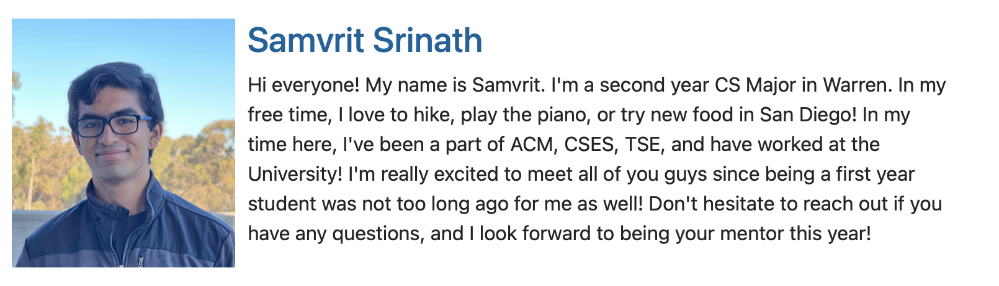
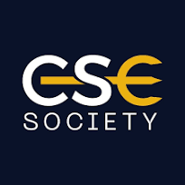
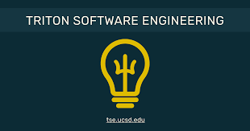

# Samvrit Srinath

## Programmer, Avid AI and Networking Enthusiast, Wannabe Chef

> [!Note]
> This site is an ongoing effort for CSE 110 Lab 1. Please check back for updates!

Thank you for coming to my website! I am currently a **2nd Year** Student studying at the _University of California, San Diego_ pursuing a degree in **Computer Science**. I am passionate about programming, AI, and networking. I am also a huge fan of cooking and love to experiment with new recipes. I am always looking for new opportunities to learn and grow, so feel free to reach out to me!

## Table of Contents

- [Samvrit Srinath](#samvrit-srinath)
  - [Programmer, Avid AI and Networking Enthusiast, Wannabe Chef](#programmer-avid-ai-and-networking-enthusiast-wannabe-chef)
  - [Table of Contents](#table-of-contents)
  - [Self-Profile](#self-profile)
  - [Coursework](#coursework)
    - [Lower Division](#lower-division)
    - [Upper Division](#upper-division)
    - [Current Coursework](#current-coursework)
  - [Clubs + Extracurriculars](#clubs--extracurriculars)
    - [Snippets](#snippets)
    - [To do:](#to-do)
    - [Club List](#club-list)
    - [Photos](#photos)
  - [Random](#random)

## Self-Profile

Attached is a bio of myself that I made for one of my extracurriculars: CSE-PACE!



## Coursework

In my time at the University, I have taken a variety of courses that have helped me develop my skills as a programmer.

### Lower Division

For my lower division Coursework, I have taken the following courses:

1. CSE 11: Introduction to Java Programming
2. CSE 12: Basic Data Structures and Object-Oriented Design
3. CSE 15L: Software Tools and Techniques Laboratory
4. CSE 20: Discrete Mathematics
5. CSE 21: Mathematics for Algorithms and Systems
6. CSE 30: Computer Organization and Systems Programming
7. CSE 91: CSE PACE

### Upper Division

For my upper division Coursework, I have taken the following courses:

-   CSE 100: Advanced Data Structures
-   CSE 101: Design and Analysis of Algorithms
-   CSE 151A: Introduction to Machine Learning
-   CSE 158: Recommender Systems
-   CSE 142: Computer Architecture
-   CSE 160: Introduction to Parallel Computing
-   CSE 132A: Database System Principles

### Current Coursework

Currently, I am taking the following courses:

-   CSE 110: Software Engineering
-   CSE 150B: Artificial Intelligence; Search and Reasoning
-   CSE 190: Introduction to Quantum Computing
-   DSC 102: Scalable Analytics
-   EDS 124BR: Introduction to Teaching Computational Thinking
    > This may seem like a lot of courses, but I am excited at the opportunity of applying myself in a variety of fields!

## Clubs + Extracurriculars

Please see the following links for more information on my involvement in clubs and extracurriculars at UCSD:

[Clubs and Extracurriculars](Markdown/Clubs.md)

### Snippets

This lab was made in part using `git` to support version control. A list of commands that I used were:

```bash
git clone <URL>
git add <file>
git commit -m "Message"
git push
```

In particular I created a URL on the github website

> The website in particular is: [Github Repo Link](https://github.com/SamvritSrinath/CSE110Lab1/tree/main)

I also had to use the `-set-upstream` command to set the upstream branch to the main branch of the repository.

Specifically while pushing as I had already used `git add .` and `git commit -m "Message"` I had to use the following command:
`git push --set-upstream origin private` for ther branches that were involved in this lab.

### To do:

This lab marks the beginning of Spring Quarter's Software Engineering Curriculum. Furthur ahead I have to

-   [x] Complete the Lab
-   [ ] Review Lectures
-   [ ] Prepare for our Group Project
-   [ ] Continue to familiarize myself with HTML/CSS/JS and any other frameworks that may be necessary for the project
-   [ ] Continue to iterate on my personal website
-   [ ] \(Optional) Become a Meme-Lord for CSE 110

Perhaps some tasks that Are pertinent for the lab are:

-   [x] Checkout the branch `main`
-   [x] Pull the latest changes from the remote repository
-   [x] Create a `screenshots` folder in the `Labs/CSE110Lab1` directory
-   [ ] Upload all my screenshots into that directory
-   [ ] stage all my changes
-   [ ] commit my changes with a message
-   [ ] push my changes to the remote repository
-   [ ] Create a pull request to merge the changes into the main branch
-   [x] Submit on Gradescope

### Club List

Please take a look at some of the clubs I'm involved in!
A list of my current clubs are:

1. Technical Clubs:
    - [CSES][^1]
    - [ACM<sub>AI</sub>][^2]
    - [TSE][^3]
2. Non-Technical Clubs:
    - Triton Gaming
    - Hiking Club
    - Indian Student Association
    - SangamSD

### Photos





PS: If you ever need any cool desktop backgrounds, take a look at this link [Cool Space Backgrounds](https://unsplash.com/images/nature/outer-space), Unsplash tends to be my source of inspiration for my desktop backgrounds!

## Random

[Random Thoughts](Markdown/Random.md)

[^1]: CSES Website: [CSES](https://csesucsd.com/)
[^2]: ACM<sub>AI</sub> Website: [ACM<sub>AI</sub>](https://ai.acmucsd.com)
[^3]: TSE Website: [TSE](https://tse.ucsd.edu/)
